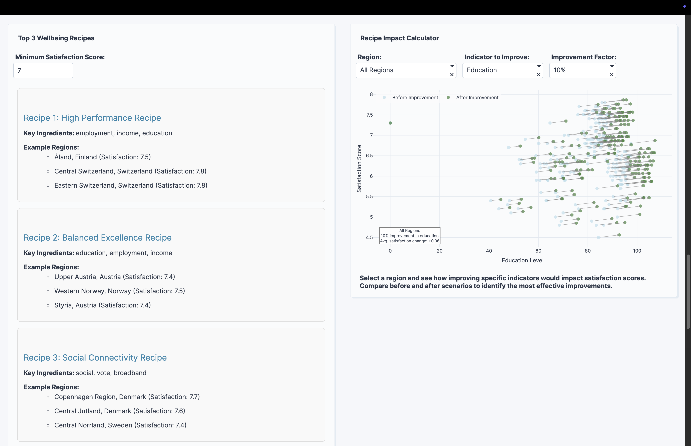
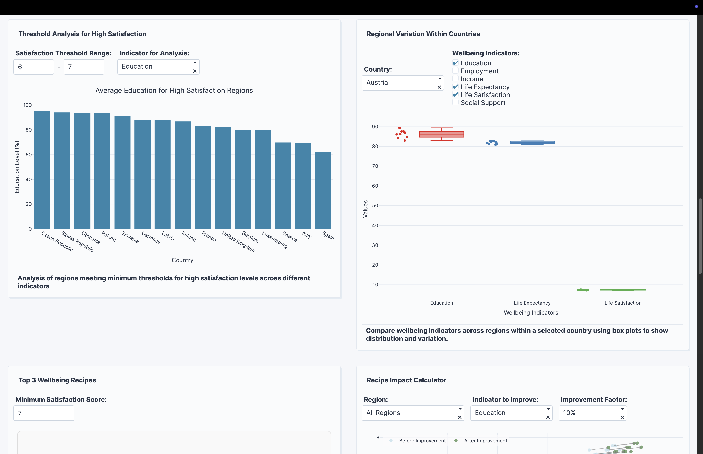

# European Regional Wellbeing Recipe Finder

🏆 **Plotly Analytics Vibe-a-Thon Submission**

An interactive data app that discovers successful "recipes" for regional wellbeing by analyzing OECD data across 208 European regions.

## 🌟 Live Demo
**[View the Interactive App](https://cf9a69f4-1328-4ffd-bf64-45c546886877.plotly.app/)**

## 🎥 Demo Video
**[Watch the Demo on YouTube](YOUR_YOUTUBE_LINK_HERE)**
*2-minute walkthrough showing how to discover wellbeing recipes and use the impact calculator*

## 📋 Overview

This app transforms complex wellbeing data into actionable insights by identifying patterns and correlations between material conditions, quality of life indicators, and subjective wellbeing outcomes. Instead of just showing statistics, it reveals "recipes" - proven combinations of policies and conditions that lead to high regional satisfaction.

## 🔬 Key Features

### 🧪 Top 3 Wellbeing Recipes
- **High Performance Recipe**: Employment + Income + Education (Switzerland, Finland)
- **Balanced Excellence Recipe**: Education + Employment + Income (Austria, Norway)
- **Social Connectivity Recipe**: Social Support + Civic Engagement + Broadband (Denmark, Sweden)

### 📊 Interactive Recipe Impact Calculator
- Select any region and simulate policy improvements
- Visualize before/after scenarios for satisfaction scores
- Identify the most effective interventions

### 🏅 Recipe Success Stories
- Showcase top-performing regions (satisfaction ≥ 7.5)
- Display their key "ingredients" for success
- Provide real examples to follow

### 📈 Comprehensive Analytics
- Correlation matrix revealing ingredient relationships
- Threshold analysis for minimum requirements
- Regional comparison tools
- Country-level variation analysis

## 📊 Dataset

- **Source**: OECD Regional Well-being Database
- **Coverage**: 208 European regions across 25 countries
- **Indicators**: 17 wellbeing dimensions including:
  - Material conditions: income, employment, housing
  - Quality of life: education, health, safety, environment
  - Subjective wellbeing: social connections, life satisfaction

## 🛠️ Built With

- **Plotly Studio**: AI-powered app generation and natural language editing
- **Plotly Cloud**: Hosting and deployment
- **Python**: Data processing and analysis
- **OECD Data**: Authoritative regional statistics

## 🎯 Impact

This app provides policymakers and researchers with:
- **Actionable insights** based on proven regional success patterns
- **Evidence-based guidance** for policy prioritization
- **Interactive tools** for scenario planning and impact assessment
- **Clear visualization** of complex multidimensional data

## 🏆 Hackathon Context

Created for the **Plotly Analytics Vibe-a-Thon** (September 2025), this project demonstrates:
- **Technological Implementation**: Advanced correlation analysis and interactive visualizations
- **Data Storytelling**: Transform statistics into compelling "recipe" narratives
- **Innovation**: Unique metaphor makes complex data accessible
- **Practical Value**: Real-world applications for regional development

## 📁 Repository Contents

- `oecd_wellbeing.csv` - Processed dataset ready for analysis
- `oecd_wellbeing.xlsx` - Original Excel dataset
- `README.md` - This documentation
- `screenshots/` - App interface screenshots

## 🚀 Usage

1. Visit the [live app](https://cf9a69f4-1328-4ffd-bf64-45c546886877.plotly.app/)
2. Explore the Top 3 Wellbeing Recipes
3. Use the Recipe Impact Calculator to simulate improvements
4. Browse Recipe Success Stories for inspiration
5. Apply filters to focus on specific regions or indicators

## 📸 Screenshots

*Interactive recipe cards showing successful policy combinations*

*Before/after visualization for policy scenario planning*

## 🤝 Contributing

This project was created for the Plotly Analytics Vibe-a-Thon. Feel free to:
- Fork the repository
- Explore the dataset
- Build your own wellbeing analysis tools
- Share insights and improvements

## 📄 License

MIT License - Feel free to use this code and data for research and educational purposes.

## 🙏 Acknowledgments

- **OECD** for providing comprehensive regional wellbeing data
- **Plotly** for the Analytics Vibe-a-Thon and amazing tools
- **European regions** for the transparency in wellbeing reporting

---

*Built with ❤️ using Plotly Studio for the Analytics Vibe-a-Thon*