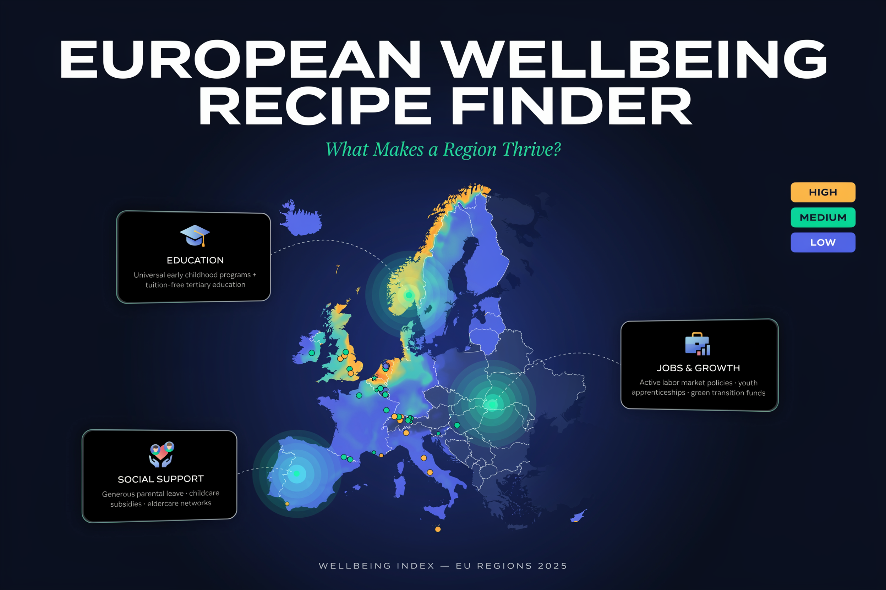

<div align="center">



# 🗺️ European Wellbeing Recipe Finder

**Discover what makes Europeans thrive — interactive wellbeing insights across 208 regions**


*Plotly Analytics Vibe-a-Thon*

</div>

<br/>

The European Wellbeing Recipe Finder transforms OECD Regional Well-being data from 208 European regions into actionable "recipes" — proven combinations of policies and conditions that drive high regional life satisfaction. Instead of surfacing raw statistics, the app reveals which ingredients (employment, education, social connectivity, and more) combine to produce thriving communities, making complex multidimensional data accessible to policymakers, researchers, and curious explorers alike.

## ✨ Features

- **Top 3 Wellbeing Recipes** — Curated recipe cards (High Performance, Balanced Excellence, Social Connectivity) derived from correlation analysis across all 208 regions, with real-world exemplar countries
- **Recipe Impact Calculator** — Select any region, simulate policy improvements across 17 wellbeing dimensions, and visualize before/after satisfaction scores interactively
- **Recipe Success Stories** — Highlight top-performing regions (satisfaction ≥ 7.5) and surface their key "ingredients" as concrete benchmarks to follow
- **Correlation Matrix** — Explore relationships between material conditions, quality-of-life indicators, and subjective wellbeing outcomes at a glance
- **Threshold Analysis** — Identify the minimum requirement levels for each indicator that separate high-satisfaction regions from the rest
- **Regional & Country Comparison** — Filter by country or region to drill into local variation and cross-border patterns

## 🚀 Live App

**[View the Interactive App →](https://cf9a69f4-1328-4ffd-bf64-45c546886877.plotly.app/)**

1. Explore the Top 3 Wellbeing Recipes
2. Use the Recipe Impact Calculator to simulate improvements for any region
3. Browse Recipe Success Stories for evidence-based inspiration
4. Apply filters to focus on specific countries or indicators

## 🛠️ Tech Stack

**Plotly Studio** · **Plotly Cloud** · **Python** · **OECD Regional Well-being Database**

| Layer | Tool |
|---|---|
| App generation & editing | Plotly Studio (AI-powered, natural language) |
| Hosting & deployment | Plotly Cloud |
| Data processing | Python |
| Dataset | OECD Regional Well-being Database (208 regions, 25 countries, 17 indicators) |

## 📁 Repository Contents

```
european-wellbeing-recipe-finder/
├── oecd_wellbeing.csv      # Processed dataset ready for analysis
├── oecd_wellbeing.xlsx     # Original Excel dataset
├── screenshots/            # App interface screenshots
└── README.md
```

## 🏆 Hackathon Context

Created for the **Plotly Analytics Vibe-a-Thon** (September 2025). The project demonstrates advanced correlation analysis, interactive visualizations, and a unique "recipe" metaphor that makes complex wellbeing data immediately actionable for real-world regional development.

## 🤝 Contributing

Fork the repo, explore the dataset, or build your own wellbeing analysis on top of it. Issues and PRs are welcome.

## 📄 License

MIT — free to use for research and educational purposes.

---

*Built with Plotly Studio for the Analytics Vibe-a-Thon · Data: OECD*
